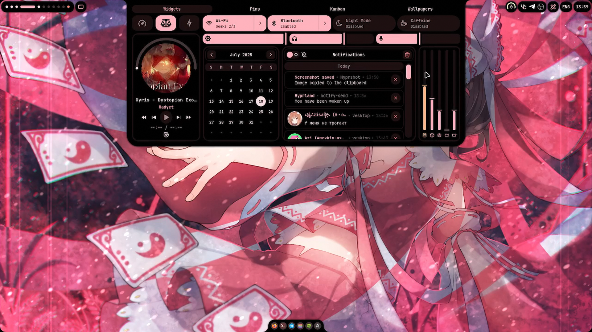

# DOTFILES
## DESCRIPTION
This dot is made only for my convenience, PC configuration and needs, I do not take responsibility for the non-working configuration or software

## MY LAPTOP CONFIG
- [Arch Linux](https://archlinux.org)
- [Hyprland](https://github.com/hyprwm/Hyprland)
- CPU -> Intel 13TH Gen
- GPU -> RTX 3050 6GB
- RAM -> 16GB
- SSD -> 512GB
- Monitor -> 1920x1080 "15.6" 144Hz

## FIREFOX THEME/EXTENSIONS
- [Catppuccin Mocha Flamingo](https://addons.mozilla.org/en-US/firefox/addon/catppuccin-mocha-flamingo-git/)
- [Vimium](https://addons.mozilla.org/en-US/firefox/addon/vimium-ff/)

## DEPENDENCIES
All necessary dependencies and software are located in the [file](scripts/packages.py)

## PREVIEW
<div align="center">



<br /><br />

# SDDM
dependencies
```bash
sudo pacman -S qt5-declarative qt5-quickcontrols2 qt5-graphicaleffects xdg-desktop-portal xdg-desktop-portal-gtk
```

copy sddm theme
```bash
sudo cp -r .system/sddm/themes/catppuccin-mocha /usr/share/sddm/themes/
sudo mkdir -p /etc/sddm.conf.d
sudo cp .system/sddm/sddm.conf.d/theme.conf.user /etc/sddm.conf.d
```

preview sddm
```bash
sddm-greeter --test-mode --theme /usr/share/sddm/themes/catppuccin-mocha/
```


# KEYBINDINGS

## SYSTEM
| Key                            | Action                                           |
|--------------------------------|--------------------------------------------------|
| `Super + Return(Enter)`        | Launch terminal                                  |
| `Super + Shift + M`            | Exit from Hyprland                               |
| `Super + Shift + R`            | Open App Launcher                                |
| `Super + D`                    | Open Dashboard                                   |
| `Super + Q`                    | Open Pinned Files                                |
| `Super + N`                    | Open Kanban                                      |
| `Super + Escape`               | Open Power Menu                                  |
| `Super + S`                    | Open Toolbox                                     |
| `Super + E`                    | Open File Manager                                |
| `Super + B`                    | Open Browser(Firefox)                            |
| `Super + ,`                    | Open Wallpapers                                  |
| `Super + Shift + ,`            | Choose random wallpaper                          |
| `Super + .`                    | Open Emojis                                      |
| `Super + Alt + B`              | Reload Ax-Shell                                  |
| `Super + T`                    | Open Tmux                                        |
| `Super + Shift + V`            | Open Clipboard History                           |


## WINDOW KEYBINDINGS
| Key                            | Action                                           |
|--------------------------------|--------------------------------------------------|
| `Super + Shift + Q`            | Close window                                     |
| `Super + V`                    | Toggle floating mode                             |
| `Super + P`                    | Pseudo Window(only dwindle)                      |
| `Super + U`                    | ToggleSplit(only dwindle)                        |
| `Super + F`                    | Fullscreen                                       |
| `Super + Tab`                  | Select window                                    |
| `Super + Shift + H`            | Move window to the left                          |
| `Super + Shift + L`            | Move window to the right                         |
| `Super + Shift + K`            | Move window up                                   |
| `Super + Shift + J`            | Move window down                                 |
| `Super + Ctrl + H`             | Resize window to the left                        |
| `Super + Ctrl + L`             | Resize window to the right                       |
| `Super + Ctrl + K`             | Resize window up                                 |
| `Super + Ctrl + J`             | Resize window down                               |
| `Super + 1-9`                  | Switch workspaces                                |
| `Super + Shift + 1-9`          | Move window to workspace                         |
| `Super + S`                    | Toggle special workspace                         |
| `Super + Shift + S`            | Move window to special workspace                 |
| `Super + O`                    | Change to dwindle layout                         |
| `Super + Shift + O`            | Change to master layout                          |


# BUILD
```bash
git clone https://github.com/kipoha/arch-dotfiles.git
cd arch-dotfiles
make
```
